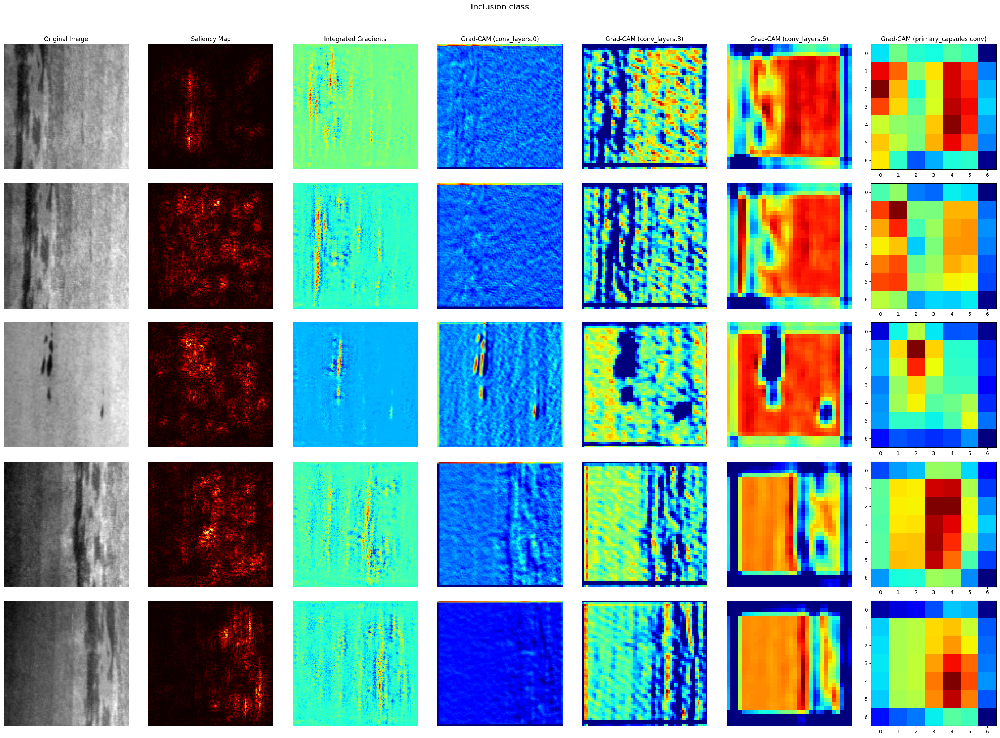

## CapsNet image classification

Pytorch Cuda required.

### Split into 2 sections (jupyter files):
1. Train part including fine tuning using optuna.
2. Evaluation on test dataset including explicable AI part.

